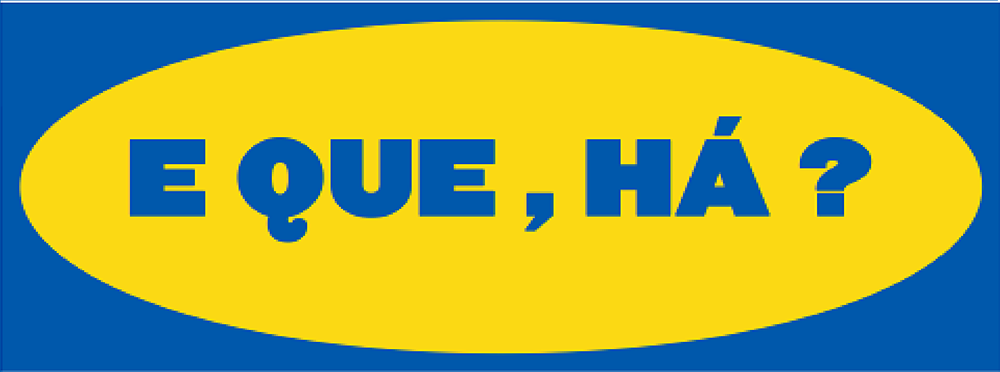

[![Contributors][contributors-shield]][contributors-url]
[![Forks][forks-shield]][forks-url]
[![Stargazers][stars-shield]][stars-url]
[![Issues][issues-shield]][issues-url]
[![MIT License][license-shield]][license-url]
[![LinkedIn][linkedin-shield]][linkedin-url]

<!-- PROJECT LOGO -->
 

  

  <h3 align="center">E QUE, HÁ?</h3>

  

    University project in vue
     
    
  

<!-- TABLE OF CONTENTS -->

  
Table of Contents

  <ol>
    <li>
      <a href="#about-the-project">About The Project</a>
      <ul>
        <li><a href="#built-with">Built With</a></li>
      </ul>
    </li>
    <li><a href="#usage">Usage</a></li>
    <li><a href="#contact">Contact</a></li>
  </ol>

<!-- ABOUT THE PROJECT -->
## About The Project

...

### Built With

...

* [Vue](https://vuejs.org/)
* [Vuetify](https://vuetifyjs.com/en/)
* [Vue-Chartsjs](https://vue-chartjs.org/)
* [Expressjs](https://expressjs.com/)
* [Insomnia](https://expressjs.com/)
* [Sequelize](https://sequelize.org/)
* [PostgreSQL](https://www.postgresql.org/)
* [AWS](https://aws.amazon.com/pt/)
* [JWT](https://jwt.io/)

<!-- USAGE EXAMPLES -->
## Usage
* User

*Admin 

<!-- CONTACT -->
## Contact

Pedro Vieira - [@iampedrovieira](https://twitter.com/iampedrovieira) - pedro97vieira@gmail.com

Project Link: [https://github.com/iampedrovieira/E-QUE-HA](https://github.com/iampedrovieira/E-QUE-HA)

<!-- MARKDOWN LINKS & IMAGES -->
<!-- https://www.markdownguide.org/basic-syntax/#reference-style-links -->
[contributors-shield]: https://img.shields.io/github/contributors/iampedrovieira/E-QUE-HA/.svg?style=for-the-badge
[contributors-url]: https://github.com/iampedrovieira/E-QUE-HA/graphs/contributors
[forks-shield]: https://img.shields.io/github/forks/iampedrovieira/E-QUE-HA/.svg?style=for-the-badge
[forks-url]: https://github.com/iampedrovieira/E-QUE-HA/network/members
[stars-shield]: https://img.shields.io/github/stars/iampedrovieira/E-QUE-HA/.svg?style=for-the-badge
[stars-url]: https://github.com/iampedrovieira/E-QUE-HA/stargazers
[issues-shield]: https://img.shields.io/github/issues/iampedrovieira/E-QUE-HA/.svg?style=for-the-badge
[issues-url]: https://github.com/iampedrovieira/E-QUE-HA/issues
[license-shield]: https://img.shields.io/github/license/iampedrovieira/E-QUE-HA/.svg?style=for-the-badge
[license-url]: https://github.com/iampedrovieira/E-QUE-HA/blob/master/LICENSE.txt
[linkedin-shield]: https://img.shields.io/badge/-LinkedIn-black.svg?style=for-the-badge&logo=linkedin&colorB=555
[linkedin-url]: https://www.linkedin.com/in/pedro-vieira-0561781b8/
[product-screenshot]: images/screenshot.png
